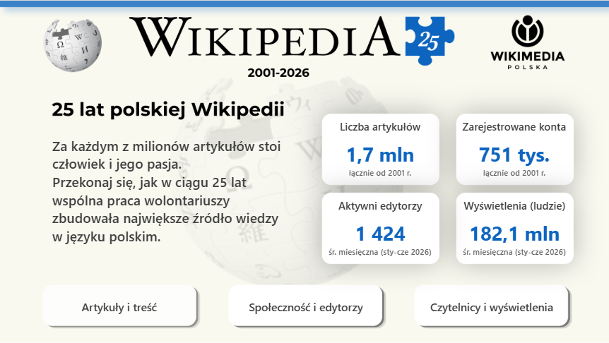
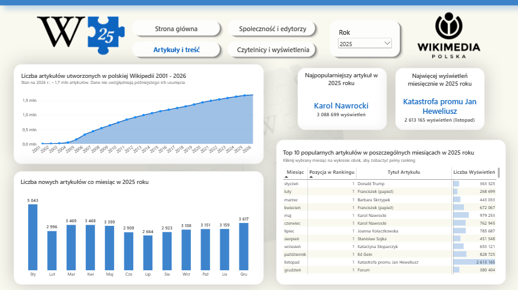
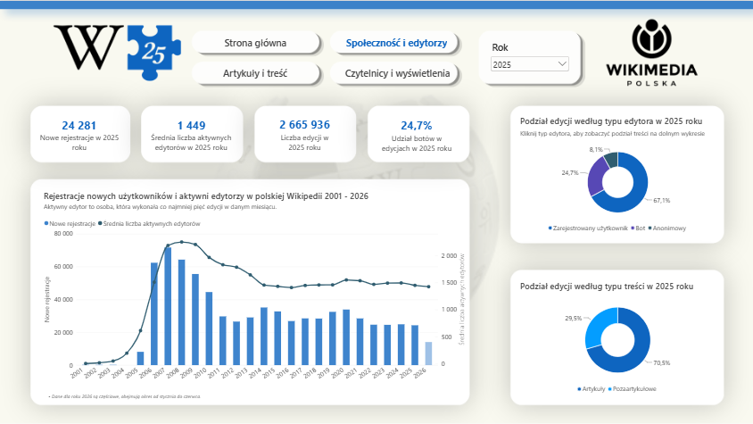
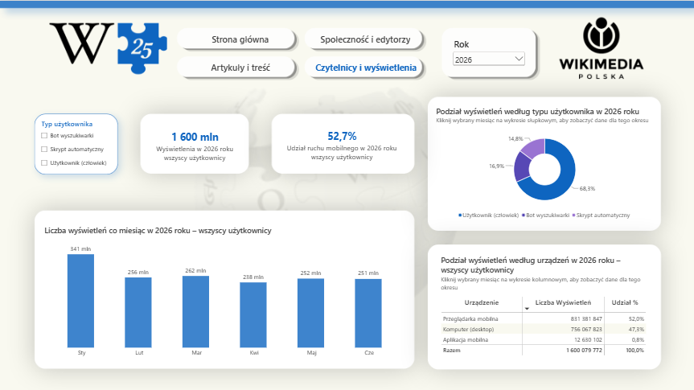

# Wikipedia Poland Analysis (2001–2026)

## 📌 Project Overview
In celebration of the **25th anniversary of Polish Wikipedia**, this project analyzes historical data from the world's largest online encyclopedia. Developed as part of the 3rd edition of the **#BI_NGO** initiative (Business Intelligence for NGOs), it supports **Wikimedia Poland Association** in understanding and sharing insights about Wikipedia's growth.

This project delivers an end-to-end analysis of Polish Wikipedia's activity over a 25-year period (2001–2026). Using Wikimedia datasets, I built an interactive Power BI dashboard structured around three core pillars:

1. **Articles & Content (Artykuły i treść):** Evaluating the pace of content expansion and extracting rankings of the most popular articles.
2. **Community & Editors (Społeczność i edytorzy):** Analyzing new user registrations, tracking editor activity levels, and breaking down edits performed by human contributors vs. automated bots.
3. **Readership & Pageviews (Czytelnicy i wyświetlenia):** Checking overall pageview counts and breaking them down by user types and the types of devices used to browse Wikipedia.

## 📊 Interactive Dashboard Preview

**Live Report:** You can explore the fully interactive Power BI report directly in your browser:  
> 👉 **[Open Interactive Power BI Dashboard](https://app.powerbi.com/view?r=eyJrIjoiYTBhZjZjMmQtNDMzNC00NWFkLWEyZTktOWU0OTAyZWE4ZTM5IiwidCI6ImQwMzYzN2RmLTdiM2EtNDU2NC04NzBiLTA2MjJhODFhNzY0ZCJ9)**
>
> *(If the live preview is unavailable or loading, watch the quick feature walkthrough video below)*
>
> The video above demonstrates the interactive features of the dashboard. Detailed descriptions of the charts and pages can be found below.
> 

https://github.com/user-attachments/assets/6c9abcb8-ee0c-49fa-b8c2-b79d26f59a64

>
### 📊 Page 1: Home page

> 
### 📊 Page 2: Articles & Content (Artykuły i treść)

### 📊 Page 3: Community & Editors (Społeczność i edytorzy)

### 📊 Page 4: Readership & Pageviews (Czytelnicy i wyświetlenia)

## 🛠️ Tech Stack & Tools

* **Power BI Desktop** – Data modeling, interactive visualization, and dashboard building.
* **Python (Pandas)** – Automated data exploration, cleaning, date standardization, and structural transformation of CSV files.
* **DAX (Data Analysis Expressions)** – Created calculated measures.
* **Power Query** – Additional data transformation.
* **GitHub** – Documentation, version control, and project hosting.

##⚙️ Data Pipeline & ETL Process

Before building the dashboard in Power BI, I developed a Python-based data pipeline to explore, validate, and transform multi-source Wikimedia datasets into a clean, analytics-ready format:

1. Data Exploration & Quality Check: Executed Python scripts to perform exploratory data analysis (EDA), detect missing values, and inspect data distributions across historical Wikimedia export files.
2. Cleaning & Standardization: Used pandas to clean raw source data, filter out unused attributes, and standardize column naming across different files.
3. Schema & Date Alignment: Formatted and unified date/year fields across all distinct datasets to enable seamless relationship mapping and star-schema integration inside Power BI.
4. Export: Generated clean, structured CSV files ready for import into the Power BI data model.

The complete Python source scripts are located in the repository directory, ensuring end-to-end reproducibility of the data transformation process.
